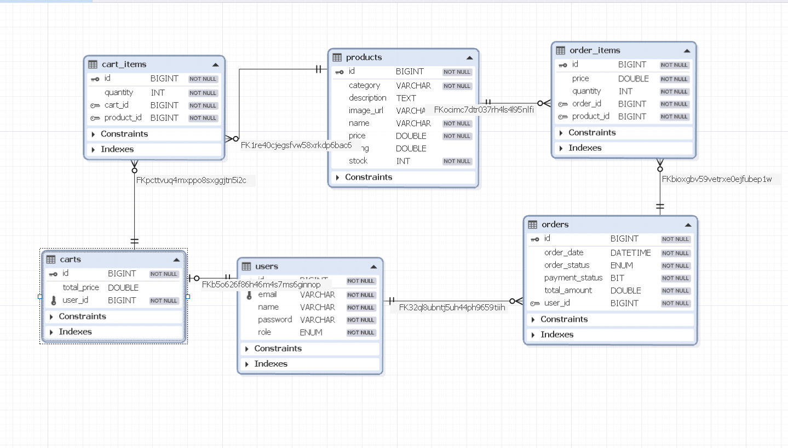
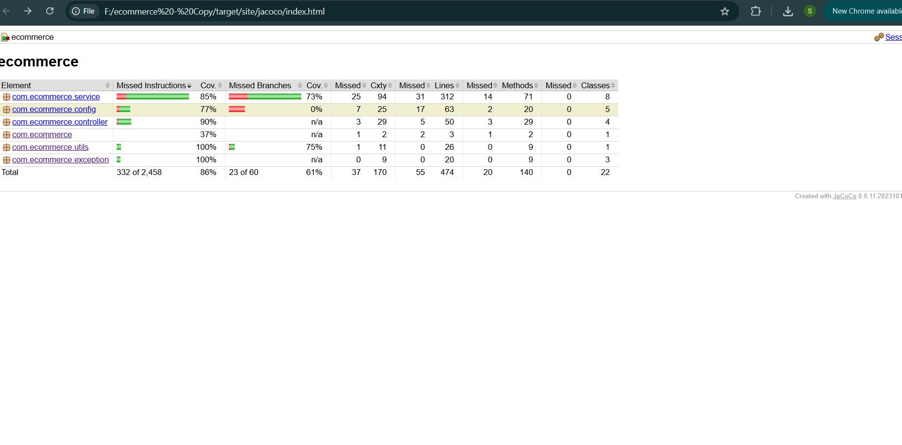

# 🛒 E-Commerce Backend System

A scalable and production-ready **backend system for an e-commerce platform** built using **Java 21, Spring Boot 3, and MySQL**.

The system follows modern backend engineering practices including:

* **Layered Architecture**
* **RESTful API Design**
* **JWT-based Authentication**
* **Secure Role-Based Authorization**
* **Cloud Deployment**
* **Dockerized Environment**
* **Automated Test Coverage using JaCoCo**

This project demonstrates how a **real-world e-commerce backend system** can be designed, implemented, and deployed using modern backend technologies.

---

# 🌍 Live Deployment

The backend is **deployed on Render** and accessible publicly.

### 🔗 Live API Documentation

https://ecommerce-backend-2-tu2o.onrender.com/swagger-ui/index.html

Using Swagger you can:

* Explore all REST APIs
* Send requests directly from the browser
* Authenticate using JWT tokens
* Test API responses

---

# 🚀 Core Features

## 👤 User Management

Handles authentication and user administration.

Capabilities include:

* User registration
* Secure login using **JWT authentication**
* Role-based access control (**ADMIN / CUSTOMER**)
* Profile management
* Admin control over platform users

### Security Implementation

* Password encryption using **BCrypt**
* Stateless authentication using **JWT tokens**
* Endpoint protection using **Spring Security filters**
* Secure request validation

---

## 📦 Product Management

Allows administrators to manage products and customers to browse available items.

Features include:

* Add new products
* Update product details
* Delete products
* View product catalog
* Pagination support
* Filtering support

This module enables **efficient product management for scalable e-commerce systems.**

---

## 🛒 Cart Management

The cart module enables customers to manage products before checkout.

Supported operations:

* Add items to cart
* Update cart quantities
* Remove items from cart
* Automatic total calculation

Each cart is linked to the **authenticated user session**.

---

## 📑 Order Management

Handles the order lifecycle from checkout to tracking.

Features include:

* Place orders
* Track order history
* View order details
* Manage order statuses

Orders are generated from cart items and stored using **relational database mapping**.

---

## 📉 Inventory Management

Maintains accurate stock levels for all products.

When an order is placed:

* Product stock is automatically reduced
* Inventory consistency is maintained
* Overselling is prevented

---

## 💳 Payment Processing

A **simulated payment gateway** is implemented to demonstrate checkout flow.

Workflow:

1. User initiates checkout
2. Payment is processed (simulation)
3. Order is created
4. Inventory is updated

This structure allows future integration with real payment gateways like:

* Stripe
* Razorpay
* PayPal

---

# 🏗️ Technology Stack

| Layer             | Technology                  |
| ----------------- | --------------------------- |
| Language          | Java 21                     |
| Framework         | Spring Boot 3               |
| Build Tool        | Maven                       |
| Database          | MySQL                       |
| ORM               | Spring Data JPA / Hibernate |
| Security          | Spring Security + JWT       |
| API Documentation | Swagger (OpenAPI 3)         |
| Object Mapping    | ModelMapper                 |
| Testing           | JUnit                       |
| Code Coverage     | JaCoCo                      |
| Containerization  | Docker                      |
| Cloud Hosting     | Render                      |

---

# 📂 Project Architecture

The project follows a **layered architecture pattern**.

```
controller  → Handles incoming HTTP requests
service     → Contains business logic
repository  → Handles database interaction
entity      → JPA entity models
dto         → Request & response objects
security    → JWT authentication filters
config      → Spring configuration
```

### Architectural Benefits

* Clear separation of concerns
* Easy debugging and maintenance
* Improved scalability
* Clean code structure

---

# 📁 Project Structure

```
src/main/java
│
├── controller
│   └── REST API endpoints
│
├── service
│   └── Business logic layer
│
├── repository
│   └── Database access layer
│
├── entity
│   └── JPA entity models
│
├── dto
│   └── Request / response objects
│
├── security
│   └── JWT authentication filters
│
└── config
    └── Application configuration
```

---

# 🗄️ Database Design (ER Diagram)

The system uses a relational schema connecting key entities:

* Users
* Products
* Cart
* Orders
* Order Items

<p align="center">
  
</p>

---

# 🧪 Test Coverage (JaCoCo)

Unit tests are implemented to ensure reliability of the core business logic.

JaCoCo is integrated to generate **code coverage reports**.

<p align="center">
  
</p>

Benefits of JaCoCo:

* Identify untested code
* Improve reliability
* Maintain high code quality

---

# 📚 API Documentation

Swagger is integrated for API testing and documentation.

### Access Swagger

```
https://ecommerce-backend-2-tu2o.onrender.com/swagger-ui/index.html
```

Swagger allows developers to:

* Explore REST endpoints
* Send API requests
* Authenticate using JWT
* Test responses interactively

---

# 🔐 Authentication Flow

Authentication uses **JWT (JSON Web Tokens)**.

### Login Request

```
POST /api/users/login
```

### Authentication Steps

1. User sends login credentials
2. Server validates credentials
3. JWT token is generated
4. Token is returned in response
5. Client includes token in subsequent requests

Example header:

```
Authorization: Bearer <token>
```

Spring Security validates the token before granting access.

---

# ☁️ Deployment (Render)

The application is deployed using **Render cloud platform**.

Deployment pipeline:

```
GitHub Repository
        ↓
Render Build
        ↓
Spring Boot Application
        ↓
Public API Endpoint
```

Render automatically:

* Pulls code from GitHub
* Builds the application
* Deploys the container
* Provides a public URL

---

# ⚙️ Environment Variables (Production)

In Render, the following environment variables are configured:

```
SPRING_DATASOURCE_URL
SPRING_DATASOURCE_USERNAME
SPRING_DATASOURCE_PASSWORD
JWT_SECRET
```

These variables allow the application to connect to the **cloud database securely**.

---

# 🛠️ Running Locally (Development)

You can also run the project locally for development.

### Prerequisites

* Java 21+
* Maven
* MySQL

### Run Application

```
./mvnw clean install
./mvnw spring-boot:run
```

Application will start at:

```
http://localhost:8080
```

---

# 📦 Repository Contents

This repository includes:

* Complete **Spring Boot Backend Source Code**
* Swagger API Documentation
* Database schema
* Docker configuration
* Postman API collection
* ER Diagram
* JaCoCo coverage report

---

# 🎯 Key Learning Outcomes

This project demonstrates:

* Designing **scalable REST APIs**
* Implementing **JWT authentication**
* Building **secure Spring Boot applications**
* Managing relational databases using **JPA**
* Deploying backend services on **cloud platforms**
* Monitoring code quality with **JaCoCo coverage**

---

# 🚀 Future Improvements

Possible enhancements:

* Real payment gateway integration
* Redis caching for performance
* API rate limiting
* Microservices architecture
* CI/CD pipeline automation
* Kubernetes deployment
